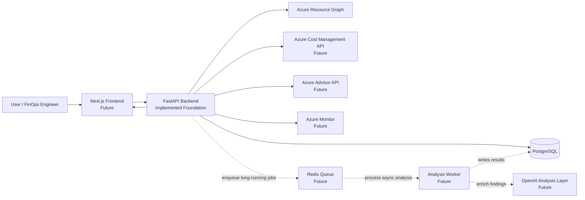
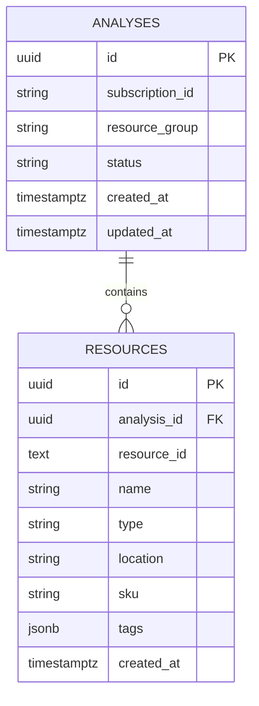
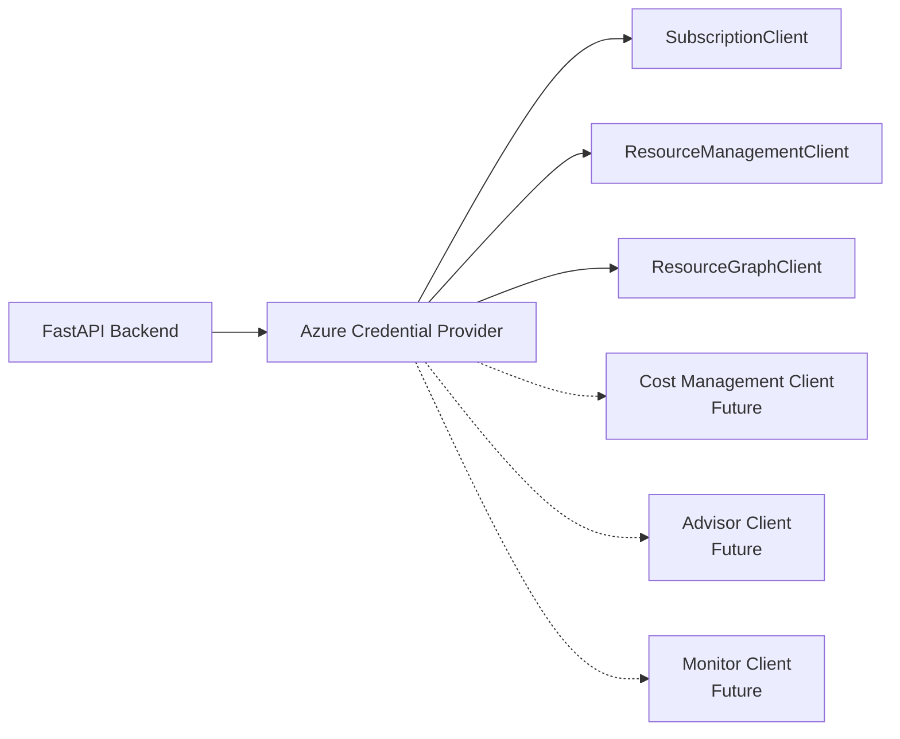
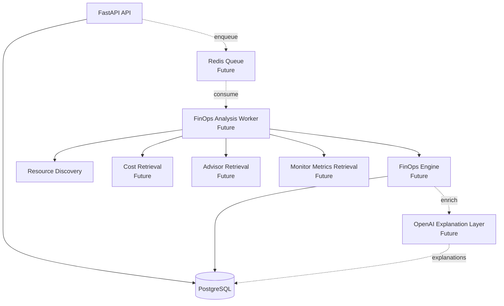
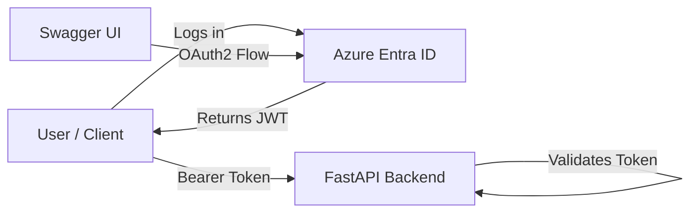
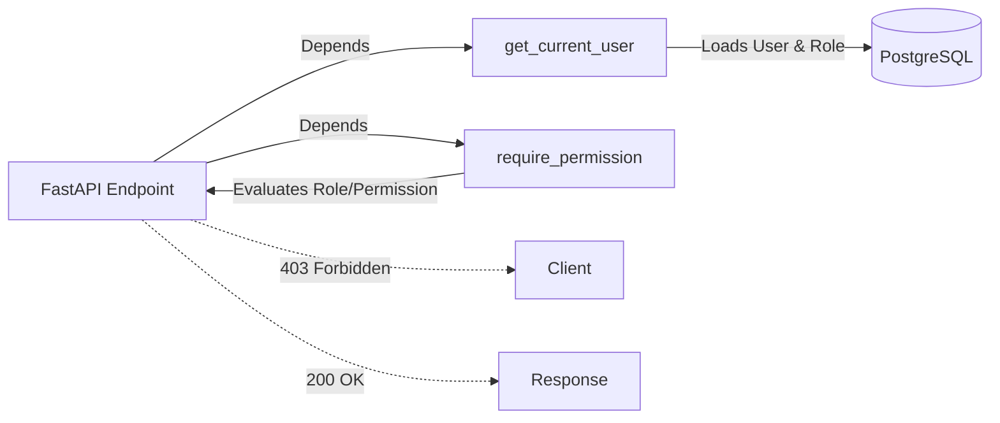

# AI Cost Detective Architecture

## Overview

AI Cost Detective is an Azure FinOps platform designed to discover Azure resources, collect cost and operational signals, evaluate optimization opportunities, and present actionable findings through a dashboard.

The current implementation provides the FastAPI backend foundation, PostgreSQL persistence, Azure SDK authentication, Azure subscription/resource group discovery, Azure Resource Graph resource discovery, SQLAlchemy models, Alembic migrations, centralized error handling, and structured logging.

Future phases will add a Next.js frontend, Azure Cost Management integration, Azure Advisor integration, Azure Monitor metrics, Redis-backed asynchronous processing, a FinOps rules engine, and an OpenAI-powered explanation layer.

## System Context

## Backend Architecture

The backend follows a clean architecture style with clear boundaries between API routing, services, repositories, schemas, database models, and core infrastructure.

```mermaid
flowchart TB
    Routes[API Routes<br/>app/api/v1]
    Dependencies[Dependency Providers<br/>app/api/dependencies.py]
    Services[Application Services<br/>app/services]
    Repositories[Repositories<br/>app/repositories]
    Schemas[Pydantic Schemas<br/>app/schemas]
    Models[SQLAlchemy Models<br/>app/models]
    DB[Database Session<br/>app/db]
    Core[Core Config, Logging, Errors<br/>app/core]
    AzureAuth[Azure Credential Provider]
    AzureSDK[Azure SDK Clients]
    Postgres[(PostgreSQL)]

    Routes --> Dependencies
    Routes --> Schemas
    Dependencies --> Services
    Services --> Repositories
    Services --> AzureAuth
    AzureAuth --> AzureSDK
    Repositories --> Models
    Repositories --> DB
    DB --> Postgres
    Core --> Routes
    Core --> Services
```

## Current Backend Modules

| Layer | Path | Responsibility |
| --- | --- | --- |
| API | `backend/app/api/v1` | Versioned REST endpoints for subscriptions, resource groups, and analysis creation. |
| Dependencies | `backend/app/api/dependencies.py` | FastAPI dependency wiring for settings, database sessions, Azure services, and analysis service. |
| Core | `backend/app/core` | Application settings, structured logging, custom exceptions, and centralized exception handlers. |
| Database | `backend/app/db` | SQLAlchemy base model, engine, session factory, and request-scoped session dependency. |
| Models | `backend/app/models` | SQLAlchemy persistence models for `Analysis` and `Resource`. |
| Schemas | `backend/app/schemas` | Pydantic v2 request and response models. |
| Repositories | `backend/app/repositories` | Database write/read boundary for analyses and resources. |
| Services | `backend/app/services` | Azure authentication, Azure resource discovery, and analysis orchestration. |
| Migrations | `backend/alembic` | Alembic migration environment and initial schema. |

## Data Model

## Azure Integration

The backend uses Azure SDKs exclusively. The current implementation includes:

- `DefaultAzureCredential` with service principal fallback support.
- `SubscriptionClient` for subscription discovery.
- `ResourceManagementClient` for resource group discovery.
- `ResourceGraphClient` for Azure resource discovery.

The platform is designed to expand with:

- Azure Cost Management API for cost and usage data.
- Azure Advisor API for optimization recommendations.
- Azure Monitor for utilization and performance metrics.

## Planned Analysis Architecture

Prompt 2 and later phases should evolve the current synchronous request path into a durable analysis pipeline.

## Production Considerations

- Long-running Azure discovery and FinOps evaluation should move to Redis-backed workers.
- Analysis state should be persisted through each stage: created, discovering resources, retrieving costs, retrieving recommendations, retrieving metrics, evaluating, completed, and failed.
- Azure exceptions should be logged internally and sanitized before returning responses.
- Resource Graph queries should support paging and bounded result collection.
- PostgreSQL should enforce useful indexes and uniqueness constraints for analysis-resource relationships.
- Swagger/OpenAPI exposure should be configurable by environment.
- Future frontend authentication and authorization should protect all tenant/subscription data.

## Authentication

The platform is secured using Azure Entra ID (OIDC) through the OpenID Connect Authorization Code Flow. Access is managed through a JSON Web Token (JWT) provided by Azure Entra ID, ensuring no local passwords or standalone authentication systems are required. The FastAPI backend validates these tokens globally across all /api/v1 routes.

## Authorization

Role-Based Access Control (RBAC) is implemented on top of the Authentication layer. Users are assigned one of three roles: `Admin`, `Analyst`, or `Viewer`.

The authorization is evaluated per route using the `require_permission` dependency. Admin actions, role changes, and permission denials are audited using an internal `AuditService`.
