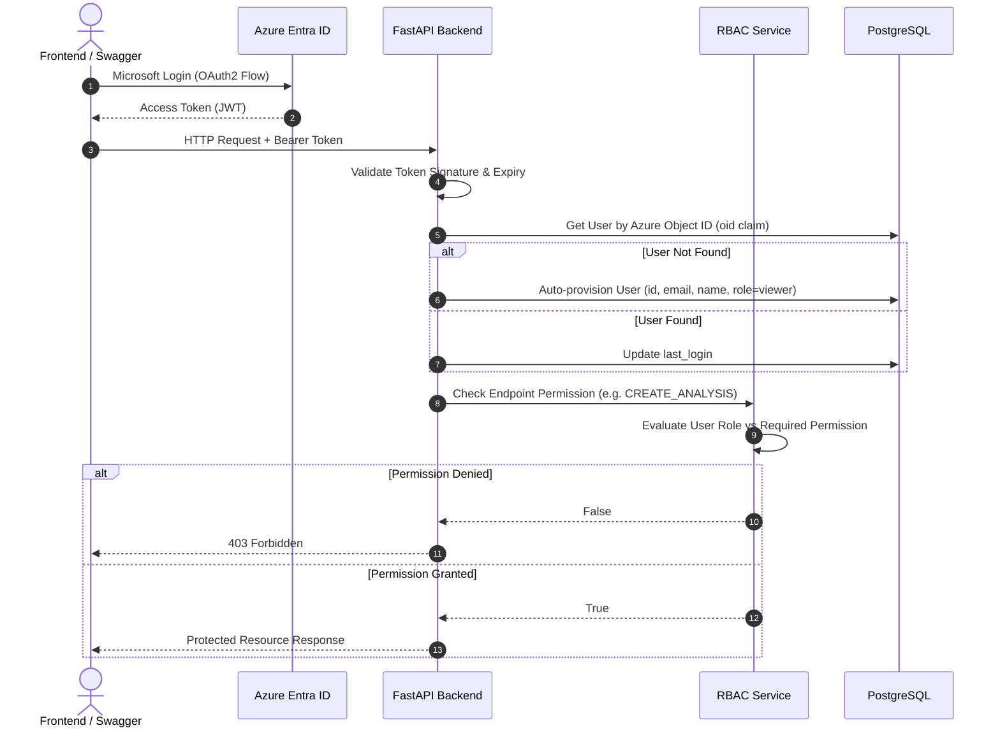
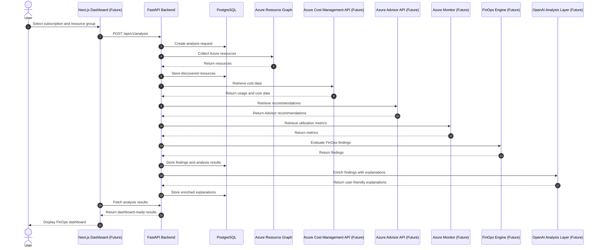
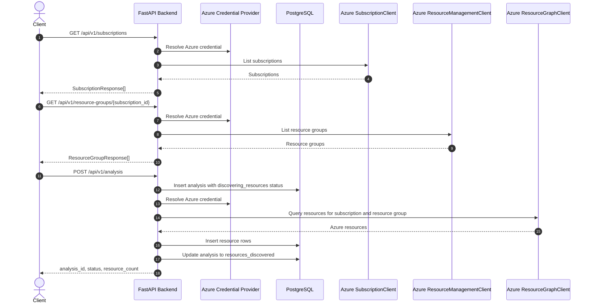
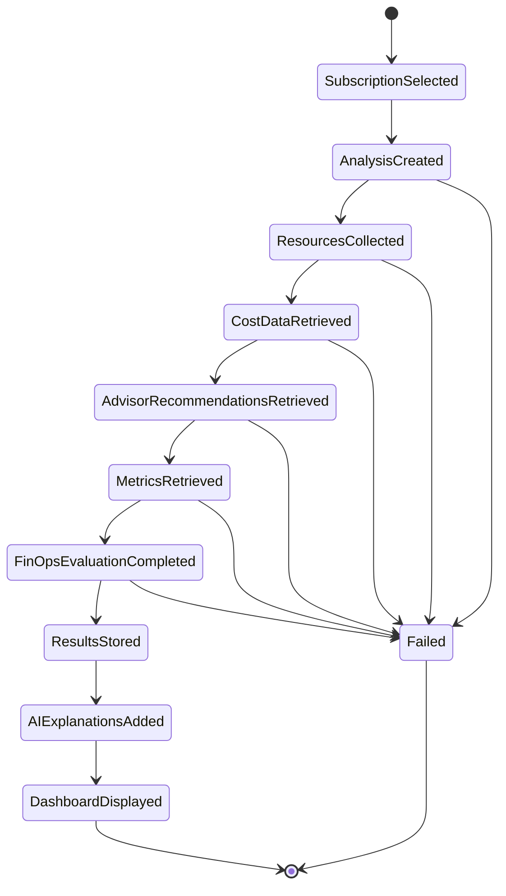
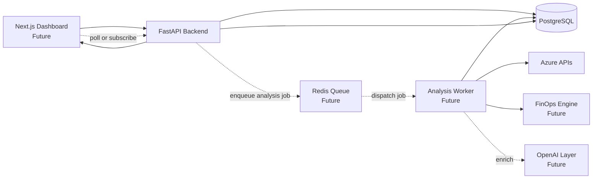

# AI Cost Detective Request Flow

## Overview

This document describes the intended end-to-end request flow for AI Cost Detective. The current backend implements the foundation through analysis creation and Azure resource collection. Cost retrieval, Advisor recommendations, Azure Monitor metrics, the FinOps engine, PostgreSQL result storage for findings, AI enrichment, Redis Queue processing, and the dashboard are planned for future phases.

## Authentication and Authorization Flow

Authentication is handled via Azure Entra ID (OIDC) using the Authorization Code Flow. 
The FastAPI backend strictly enforces JWT validation for all `/api/v1/*` endpoints. 
When an authenticated user requests an endpoint, their token is decoded, and their claims are mapped to an internal database User automatically via a just-in-time provisioning process.

After authentication, the Authorization layer evaluates the user's role and requested permissions before allowing API access.



## End-to-End Flow



## Current Implemented Flow

The implemented backend currently supports subscription discovery, resource group discovery, and synchronous resource collection for a new analysis request.



## Target Request Stages



## Detailed Flow

### 1. User Selects Subscription

The user selects an Azure subscription in the future Next.js dashboard. The backend supports this by exposing:

- `GET /api/v1/subscriptions`
- `GET /api/v1/resource-groups/{subscription_id}`

These endpoints use Azure SDK clients and return typed Pydantic response models.

### 2. Analysis Request Created

The client sends:

```http
POST /api/v1/analysis
```

```json
{
  "subscription_id": "00000000-0000-0000-0000-000000000000",
  "resource_group": "rg-production-eastus"
}
```

The backend creates an `Analysis` row in PostgreSQL and starts the discovery workflow.

### 3. Azure Resources Collected

The backend queries Azure Resource Graph for supported resource types:

- Virtual Machines
- Storage Accounts
- AKS Clusters
- Databases
- Load Balancers
- Public IPs
- Managed Disks

Discovered resources are persisted in PostgreSQL as `Resource` rows linked to the analysis.

### 4. Cost Data Retrieved

Future implementation will use Azure Cost Management APIs to retrieve cost, usage, and trend data for the selected scope.

Expected outputs include:

- Current-period cost
- Historical cost
- Daily or monthly usage trends
- Service-level cost breakdowns
- Resource-level cost attribution where available

### 5. Advisor Recommendations Retrieved

Future implementation will use Azure Advisor APIs to retrieve optimization recommendations.

Expected categories include:

- Cost
- Performance
- Reliability
- Operational excellence
- Security, where relevant for context

### 6. Metrics Retrieved

Future implementation will use Azure Monitor to retrieve utilization and performance metrics.

Expected metrics include:

- CPU utilization
- Memory utilization where available
- Disk usage and throughput
- Network usage
- Storage capacity and transactions

### 7. FinOps Engine Evaluates Findings

The future FinOps engine will combine resource inventory, cost data, Advisor recommendations, and metrics to identify optimization opportunities.

Example finding types:

- Idle or underutilized virtual machines
- Oversized compute resources
- Unattached managed disks
- Public IPs with no active association
- Storage accounts with inefficient redundancy or lifecycle configuration
- AKS clusters with inefficient node pool sizing

### 8. Results Stored in PostgreSQL

Findings, evidence, severity, estimated savings, and analysis status should be persisted in PostgreSQL.

The existing `Analysis` and `Resource` tables provide the initial foundation. Future migrations should add normalized tables for cost records, metrics, recommendations, findings, and AI explanations.

### 9. Future AI Explanation Layer Enriches Findings

The OpenAI Analysis Layer will generate plain-language explanations for findings. It should not replace deterministic FinOps rules; instead, it should explain the evidence, tradeoffs, and remediation guidance.

Expected enrichment outputs:

- Human-readable summary
- Business impact
- Technical evidence
- Recommended action
- Risk notes

### 10. Dashboard Displays Results

The future Next.js dashboard will display analysis results from PostgreSQL through FastAPI endpoints.

Expected dashboard views:

- Analysis status
- Resource inventory
- Cost trends
- Optimization findings
- Estimated savings
- AI-enriched explanations
- Exportable recommendations

## Future Asynchronous Flow

For production workloads, analysis should run asynchronously through Redis Queue.



This keeps API requests responsive, makes retries safer, and allows longer-running Azure scans without tying up web workers.

